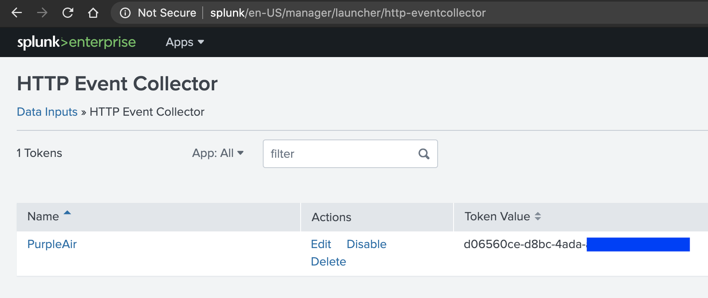
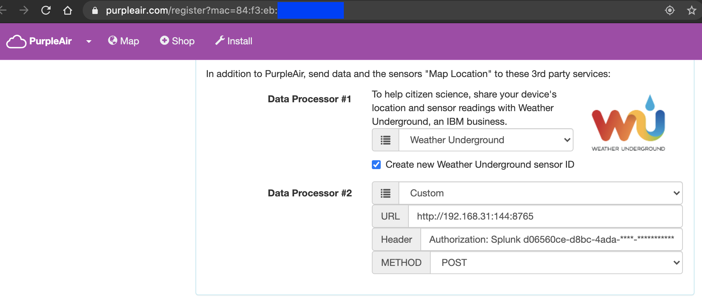

# purpleair2splunk

This tool sends the purpleair sensor data to Splunk.

It uses the custom URL feature from purpleair.com and encapsulate the data to Splunk HEC format.
It is using Nginx and Lua, from openresty

## Warning!
- Default configuration is using HTTP. You may want to setup HTTPS in the nginx_conf file if your data is travelling on another network than your home LAN
- In my setup, this purpleair2splunk containers runs on the same machine than splunk itself and I use the link feature of docker to resolve the splunk container IP address. You may wand to change the --link flag with --add-host if your Splunk lives on another machine.

## How to
1) Create a Splunk HEC and copy the token

2) Register your Purpleair device to use a Custom URL with your Splunk Authorization token

3) Run ./pa2splunk.sh
